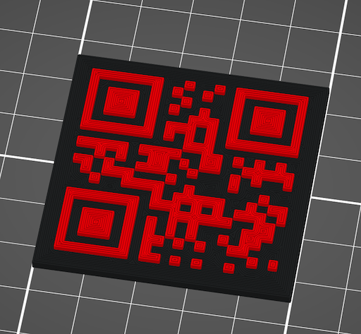
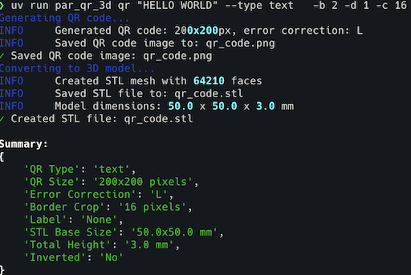

# Par QR 3D

## Description

CLI tool to generate 3D printable STL files from QR codes. Create QR codes with various data types (URLs, WiFi credentials, contact info, etc.) and convert them into 3D models suitable for 3D printing. The generated STL files can be customized with different sizes, heights, and error correction levels.

## Features

- **Multiple QR Code Types**: Generate QR codes for text, URLs, emails, phone numbers, SMS, WiFi credentials, and contact cards
- **3D Model Generation**: Convert QR codes into 3D printable STL files with customizable dimensions
- **3MF Format Support**: Export to 3MF format with full color support for multi-material 3D printing
- **Multi-Layer Heights**: Create STL files with multiple distinct layer heights for visual depth and interest
- **Configurable Parameters**: Adjust QR code size, error correction level, base dimensions, and QR pattern depth
- **Custom Colors**: Set custom colors for QR code modules and background using color names or hex codes
- **Text Labels**: Add custom text labels to QR codes with configurable positioning (top/bottom)
- **Image Overlays**: Add logo or image overlays to the center of QR codes (grayscale for STL, full color for PNG-only)
- **Decorative Frames**: Add stylish frames around QR codes (square, rounded, hexagon, octagon)
- **Artistic Patterns**: Replace standard squares with circles, dots, or rounded modules
- **Terminal Display**: View QR codes directly in your terminal using rich-pixels
- **Border Cropping**: Automatically crop white borders from QR codes (default: 15 pixels)
- **Inverted Mode**: Create inverted QR codes with recessed black areas
- **PNG-Only Mode**: Option to generate only PNG images without STL files
- **PNG Export**: Optionally save QR codes as PNG images alongside STL files
- **Rich Terminal UI**: Beautiful output with progress indicators and formatted results
- **Type Safety**: Full type annotations throughout the codebase
- **Modern Python**: Built with modern tooling including uv, ruff, and pyright

## Pictures




## Technology Stack
- **Python 3.11+** - Modern Python with latest features
- **Typer** - Modern CLI framework with Rich integration
- **Rich** - Beautiful terminal output and formatting
- **rich-pixels** - Terminal-based image display
- **qrcode** - QR code generation with PIL support
- **numpy-stl** - STL file creation and manipulation
- **Pillow** - Image processing for QR codes
- **uv** - Fast Python package management

## Prerequisites

- Python 3.11 or higher
- [uv](https://docs.astral.sh/uv/) for package management (recommended) or pip

## Installation

### Using uv (Recommended)

```bash
# Clone the repository
git clone https://github.com/paulrobello/par_qr_3d.git
cd par_qr_3d

# Install dependencies
uv sync
```

### Using pip

```bash
# Clone the repository
git clone https://github.com/paulrobello/par_qr_3d.git
cd par_qr_3d

# Create virtual environment
python -m venv venv
source venv/bin/activate  # On Windows: venv\Scripts\activate

# Install package
pip install -e .
```

## Usage

### Basic Usage

Generate a simple text QR code:

```bash
par_qr_3d qr "Hello, World!"
```

This creates:
- `qr_code.png` - The QR code image (200x200 pixels)
- `qr_code.stl` - The 3D model file (50x50x3mm)

### Specifying Output Files

```bash
par_qr_3d qr "Your text here" --output my_qr_code
# Creates my_qr_code.png and my_qr_code.stl
```

### QR Code Types

#### URL QR Code
```bash
par_qr_3d qr "example.com" --type url
# Automatically adds https:// if no protocol specified
```

#### WiFi QR Code
```bash
par_qr_3d qr "MyNetwork" --type wifi --wifi-password "secretpass" --wifi-security WPA
```

#### Email QR Code
```bash
par_qr_3d qr "user@example.com" --type email --email-subject "Hello" --email-body "Message body"
```

#### Phone Number QR Code
```bash
par_qr_3d qr "+1234567890" --type phone
```

#### SMS QR Code
```bash
par_qr_3d qr "+1234567890" --type sms --sms-message "Hello!"
```

#### Contact Card (vCard) QR Code
```bash
par_qr_3d qr "John Doe" --type contact \
  --contact-phone "+1234567890" \
  --contact-email "john@example.com" \
  --contact-org "ACME Corp"
```

### Customizing Dimensions

#### QR Code Size and Error Correction
```bash
# Larger QR code with high error correction
par_qr_3d qr "Important data" --size 400 --error-correction H

# Available error correction levels:
# L - Low (7% error correction)
# M - Medium (15% error correction)  
# Q - Quartile (25% error correction)
# H - High (30% error correction)
```

#### STL Model Dimensions
```bash
# Custom base size and depths
par_qr_3d qr "Custom model" \
  --base-width 100 \      # Base width in mm (default: 50)
  --base-height 100 \     # Base height in mm (default: 50)  
  --base-thickness 3 \    # Base layer thickness in mm (default: 2)
  --qr-depth 10          # QR pattern depth in mm (default: 1)
```

### Advanced Options

#### Text Labels
Add a text label to your QR code for easy identification:
```bash
# Add label at top (default position)
par_qr_3d qr "https://example.com" --label "Example Website"

# Add label at bottom
par_qr_3d qr "WiFi: guest123" --label "Guest Network" --label-position bottom

# Short options
par_qr_3d qr "Contact info" -l "John Doe" -L bottom
```

Labels are rendered in Roboto Black font suitable for 3D printing with a 2-pixel margin from the QR code. The text is binarized to ensure clean 3D printing without antialiasing artifacts.

You can control the binarization threshold:
```bash
# Lower threshold (more black pixels)
par_qr_3d qr "Data" --label "My Label" --label-threshold 64

# Higher threshold (more white pixels)  
par_qr_3d qr "Data" --label "My Label" --label-threshold 192

# Default threshold is 128
par_qr_3d qr "Data" --label "My Label" -k 128
```

#### Image Overlays
Add a logo or image overlay to the center of your QR code:
```bash
# Add overlay with default 20% size
par_qr_3d qr "https://example.com" --overlay-image logo.png

# Custom overlay size (25% of QR code)
par_qr_3d qr "Company URL" --overlay-image company_logo.jpg --overlay-size 25

# Combine with label
par_qr_3d qr "Contact Info" --overlay-image avatar.png --label "John Doe"

# Short options
par_qr_3d qr "Website" -I logo.png -Z 30
```

The overlay image is:
- Automatically converted to grayscale for STL generation (preserving all gray levels)
- Kept in full color when using --no-stl option
- Centered on a white background to maintain QR code scannability
- Sized as a percentage of the QR code (10-30%, default 20%)
- Supports common image formats (PNG, JPG, etc.)
- Properly handles transparency if present

#### Custom Colors
Customize the colors of your QR code using color names or hex codes:
```bash
# Use named colors
par_qr_3d qr "Colorful QR" --base-color lightblue --qr-color darkgreen

# Use hex color codes
par_qr_3d qr "Brand Colors" --base-color "#f0f0f0" --qr-color "#0066cc"

# Combine with other features
par_qr_3d qr "Company Site" \
  --base-color yellow \
  --qr-color red \
  --overlay-image logo.png \
  --label "Scan Me!"

# Short options
par_qr_3d qr "Custom" -bc pink -qc purple
```

Note: Custom colors are preserved in PNG output. STL files only contain geometry, not color information.

#### Decorative Frames
Add stylish frames around your QR codes:
```bash
# Square frame with custom width and color
par_qr_3d qr "Framed QR" --frame square --frame-width 15 --frame-color navy

# Rounded corners frame
par_qr_3d qr "Elegant QR" --frame rounded --frame-width 20 --frame-color "#ff6b6b"

# Hexagonal frame
par_qr_3d qr "Hex Frame" --frame hexagon --frame-width 25 --frame-color darkgreen

# Octagonal frame
par_qr_3d qr "Oct Frame" --frame octagon --frame-width 10 --frame-color gold

# Combine with other features
par_qr_3d qr "Complete Package" \
  --frame rounded \
  --frame-width 15 \
  --frame-color purple \
  --overlay-image logo.png \
  --label "PREMIUM" \
  --base-color lavender \
  --qr-color indigo

# Short options
par_qr_3d qr "Quick Frame" -f rounded -fw 20 -fc red
```

Frame styles available:
- **square**: Simple rectangular frame
- **rounded**: Frame with rounded corners
- **hexagon**: Six-sided frame
- **octagon**: Eight-sided frame

Note: Frames add visual appeal and can help QR codes stand out. The frame is included in both PNG and STL outputs.

#### Artistic Patterns
Replace standard square QR modules with artistic shapes:
```bash
# Circle modules (smooth, modern look)
par_qr_3d qr "Artistic QR" --style circle

# Dot pattern (minimalist style)
par_qr_3d qr "Dotted QR" --style dot --style-size 0.6

# Rounded squares (softer appearance)
par_qr_3d qr "Soft QR" --style rounded --style-size 0.85

# Combine with colors for striking designs
par_qr_3d qr "Designer QR" \
  --style circle \
  --style-size 0.9 \
  --base-color lavender \
  --qr-color purple

# Full artistic design
par_qr_3d qr "https://art.example.com" \
  --style dot \
  --style-size 0.7 \
  --frame hexagon \
  --frame-color gold \
  --base-color black \
  --qr-color gold

# Short options
par_qr_3d qr "Quick Art" -y circle -ys 0.8
```

Available styles:
- **square**: Traditional QR code modules (default)
- **circle**: Circular modules for a modern look
- **dot**: Small dots for a minimalist aesthetic
- **rounded**: Rounded corners on square modules

The `--style-size` parameter controls the size of modules relative to the grid (0.5-1.0, default 0.8).

Note: Artistic patterns maintain QR code scannability while adding visual appeal. Smaller module sizes may require higher error correction levels for reliable scanning.

#### Border Cropping
Crop white border from QR code before converting to STL (default: 15 pixels):
```bash
# Use default 15 pixel crop
par_qr_3d qr "Cropped QR"

# Custom crop amount
par_qr_3d qr "Custom crop" --border-crop 4

# Disable cropping
par_qr_3d qr "No crop" --border-crop 0
```

#### Inverted QR Code
Create an inverted QR code where black areas are recessed and white areas are raised:
```bash
par_qr_3d qr "Inverted" --invert
```

#### Display in Terminal
Show the QR code directly in the terminal:
```bash
par_qr_3d qr "Display test" --display
# Or use short option
par_qr_3d qr "Display test" -T
```

#### Skip PNG Generation
Only generate the STL file:
```bash
par_qr_3d qr "STL only" --no-save-png
```

#### 3D File Formats
Export to different 3D file formats:
```bash
# Default STL format
par_qr_3d qr "STL Model" --output my_model
# Creates my_model.stl

# 3MF format with colors
par_qr_3d qr "Colored Model" --format 3mf \
  --base-color lightblue \
  --qr-color darkgreen
# Creates a 3MF file with embedded color information

# 3MF with separate components for better slicer support
par_qr_3d qr "Slicer Ready" --format 3mf \
  --separate-components \
  --base-color white \
  --qr-color black
# Creates separate mesh objects for each color

# Combine 3MF with other features
par_qr_3d qr "Advanced 3MF" --format 3mf \
  --base-color "#ff6b6b" \
  --qr-color "#4ecdc4" \
  --frame hexagon \
  --frame-color gold \
  --style circle

# Short option
par_qr_3d qr "Quick 3MF" -F 3mf
```

3MF advantages:
- Full color support for multi-material 3D printing
- Better compatibility with modern slicers
- More efficient file format than STL
- Supported by Windows 3D Builder, PrusaSlicer, Cura, etc.
- Uses lib3mf for proper material and color handling
- Option to export as separate components for improved slicer compatibility

#### Multi-Layer STL Generation
Create STL files with multiple distinct layer heights for more visually interesting 3D prints:
```bash
# Basic multi-layer with automatic heights
par_qr_3d qr "Multi-Layer QR" --multi-layer

# Custom layer heights (base, QR modules, frame)
par_qr_3d qr "Custom Layers" --multi-layer --layer-heights "2,4,6"

# Multi-layer with frame (3 distinct heights)
par_qr_3d qr "Layered Frame" --multi-layer \
  --frame hexagon \
  --frame-width 25

# Custom heights with rounded frame
par_qr_3d qr "Premium Layered" --multi-layer \
  --layer-heights "1,3,5" \
  --frame rounded \
  --frame-width 30 \
  --frame-color gold

# Short options
par_qr_3d qr "Quick Layers" -ML -LH "2,5,8"
```

Multi-layer features:
- **Automatic Heights**: If --layer-heights not specified, uses sensible defaults
- **Base Layer**: Always at the specified height (default 2mm)
- **QR Layer**: Raised modules at second height
- **Frame Layer**: Optional third height for frames (when --frame is used)
- **Visual Depth**: Creates more interesting 3D models with distinct layer separation

#### PNG-Only Mode
Skip STL generation and only create PNG images:
```bash
# Basic PNG-only generation
par_qr_3d qr "PNG only" --no-stl

# With full color overlay (not converted to grayscale)
par_qr_3d qr "Color Logo" --no-stl --overlay-image logo.png

# With custom colors
par_qr_3d qr "Colorful PNG" --no-stl \
  --base-color "#ff6b6b" \
  --qr-color "#4ecdc4" \
  --overlay-image brand_logo.png

# Short option
par_qr_3d qr "Quick PNG" -N
```

This is useful for:
- Quick QR code generation without 3D modeling
- Preserving full color in overlays
- Faster processing when STL is not needed
- Creating QR codes for digital use only

#### Debug Mode
Enable verbose output for troubleshooting:
```bash
par_qr_3d qr "Debug test" --debug
```

### Examples

#### Business Card QR Code
```bash
par_qr_3d qr "Jane Smith" \
  --type contact \
  --contact-phone "+1-555-0123" \
  --contact-email "jane.smith@company.com" \
  --contact-org "Tech Innovations Inc" \
  --output business_card \
  --size 300 \
  --base-width 85.6 \
  --base-height 53.98 \
  --qr-depth 4
```

#### WiFi Guest Network Sign
```bash
par_qr_3d qr "GuestNetwork" \
  --type wifi \
  --wifi-password "welcome2024" \
  --wifi-security WPA \
  --label "Guest WiFi" \
  --output guest_wifi \
  --size 400 \
  --error-correction H \
  --base-width 120 \
  --base-height 120 \
  --qr-depth 8
```

#### Product URL Tag
```bash
par_qr_3d qr "https://shop.example.com/product/12345" \
  --type url \
  --output product_tag \
  --size 200 \
  --base-width 50 \
  --base-height 50 \
  --base-thickness 1.5 \
  --qr-depth 3
```

#### Company Website with Logo
```bash
par_qr_3d qr "https://company.com" \
  --type url \
  --overlay-image company_logo.png \
  --overlay-size 25 \
  --label "Visit Our Website" \
  --label-position bottom \
  --output company_qr \
  --size 400 \
  --error-correction H \
  --base-width 100 \
  --base-height 100
```

#### Branded QR Code (PNG Only)
```bash
par_qr_3d qr "https://brand.com/promo" \
  --type url \
  --no-stl \
  --base-color "#f8f9fa" \
  --qr-color "#007bff" \
  --overlay-image brand_logo.png \
  --overlay-size 30 \
  --label "SCAN FOR 20% OFF" \
  --output promo_qr \
  --size 600 \
  --error-correction H
```

#### Premium Framed QR Code
```bash
par_qr_3d qr "https://premium.example.com" \
  --type url \
  --frame hexagon \
  --frame-width 30 \
  --frame-color gold \
  --base-color black \
  --qr-color gold \
  --overlay-image premium_logo.png \
  --label "VIP ACCESS" \
  --label-position bottom \
  --output vip_qr \
  --size 400 \
  --base-width 80 \
  --base-height 80 \
  --qr-depth 5
```

#### Artistic Business Card QR
```bash
par_qr_3d qr "John Smith" \
  --type contact \
  --contact-phone "+1-555-0123" \
  --contact-email "john@company.com" \
  --style dot \
  --style-size 0.7 \
  --base-color "#f5f5f5" \
  --qr-color "#333333" \
  --frame rounded \
  --frame-width 12 \
  --frame-color "#666666" \
  --output business_qr \
  --size 300 \
  --error-correction H
```

#### Multi-Color 3MF Model
```bash
par_qr_3d qr "https://colorful.example.com" \
  --type url \
  --format 3mf \
  --base-color coral \
  --qr-color teal \
  --style circle \
  --frame octagon \
  --frame-width 25 \
  --frame-color navy \
  --overlay-image logo.png \
  --label "SCAN ME" \
  --output colorful_qr \
  --size 400 \
  --base-width 80 \
  --base-height 80
```

#### Multi-Layer 3D Model
```bash
par_qr_3d qr "https://layered.example.com" \
  --type url \
  --multi-layer \
  --layer-heights "2,5,8" \
  --frame hexagon \
  --frame-width 30 \
  --frame-color gold \
  --label "PREMIUM ACCESS" \
  --output layered_qr \
  --size 300 \
  --base-width 100 \
  --base-height 100
```

## Output Files

The tool generates two files by default:

1. **PNG Image** (`*.png`): The QR code as a standard image file for preview and testing
2. **3D Model File**: 
   - **STL** (`*.stl`): Standard 3D model format (default)
   - **3MF** (`*.3mf`): Modern 3D format with embedded color information

The 3D model includes:
- A solid base plate covering the entire area
- Black QR code modules extruded upward from the base plate
- White areas remain at base height
- Properly closed mesh suitable for 3D printing
- Color materials embedded in 3MF files for multi-material printing

## 3D Printing Tips

1. **Print Settings**:
   - Layer height: 0.2mm or finer for better QR code definition
   - Infill: 20-30% is usually sufficient
   - No supports needed for standard models

2. **Size Considerations**:
   - Ensure the printed size is large enough for QR code scanning
   - Minimum recommended size: 30x30mm for simple QR codes
   - Larger sizes needed for complex data or high error correction

3. **Contrast**:
   - Use contrasting filament colors (black on white, white on black)
   - Consider painting the raised portions for better scanning

## CLI Options Reference

### Required Arguments
- `DATA` - The data to encode in the QR code

### Optional Arguments

| Option | Short | Description | Default |
|--------|-------|-------------|---------|
| `--output` | `-o` | Output file path (without extension) | `qr_code` |
| `--type` | `-t` | QR code type: text, url, email, phone, sms, wifi, contact | `text` |
| `--size` | `-s` | QR code size in pixels (100-1000) | `200` |
| `--error-correction` | `-e` | Error correction level: L, M, Q, H | `L` |
| `--base-width` | `-w` | STL base width in mm (10-500) | `50.0` |
| `--base-height` | `-h` | STL base height in mm (10-500) | `50.0` |
| `--base-thickness` | `-b` | Base plate thickness in mm (0.5-20) | `2.0` |
| `--qr-depth` | `-d` | QR pattern depth in mm (0.5-20) | `1.0` |
| `--invert` | `-i` | Invert QR code (black recessed) | `False` |
| `--border-crop` | `-c` | Pixels to crop from border (0-20) | `15` |
| `--label` | `-l` | Add text label to QR code | `None` |
| `--label-position` | `-L` | Label position: top or bottom | `top` |
| `--label-threshold` | `-k` | Threshold for label text binarization (0-255) | `128` |
| `--overlay-image` | `-I` | Path to image to overlay in center of QR code | `None` |
| `--overlay-size` | `-Z` | Size of overlay as percentage of QR code (10-30) | `20` |
| `--base-color` | `-bc` | Background color (name or hex code) | `white` |
| `--qr-color` | `-qc` | QR module color (name or hex code) | `black` |
| `--frame` | `-f` | Frame style: square, rounded, hexagon, octagon | `None` |
| `--frame-width` | `-fw` | Frame width in pixels (5-50) | `10` |
| `--frame-color` | `-fc` | Frame color (name or hex code) | `black` |
| `--style` | `-y` | QR module style: square, circle, dot, rounded | `square` |
| `--style-size` | `-ys` | Size ratio for styled modules (0.5-1.0) | `0.8` |
| `--no-stl` | `-N` | Skip STL generation (PNG only) | `False` |
| `--format` | `-F` | 3D file format: stl, 3mf (3mf includes colors) | `stl` |
| `--separate-components` | `-SC` | Export 3MF with separate objects for each color | `False` |
| `--multi-layer` | `-ML` | Create STL with multiple distinct layer heights | `False` |
| `--layer-heights` | `-LH` | Comma-separated layer heights in mm | `None` |
| `--save-png/--no-save-png` | `-p/-P` | Save PNG image | `True` |
| `--display` | `-T` | Display QR code in terminal | `False` |
| `--debug` | `-D` | Enable debug output | `False` |

### Type-Specific Options

#### WiFi Options
| Option | Short | Description | Default |
|--------|-------|-------------|---------|
| `--wifi-password` | `-W` | WiFi password | `None` |
| `--wifi-security` | `-S` | Security type: WPA, WEP, nopass | `WPA` |

#### Email Options
| Option | Short | Description | Default |
|--------|-------|-------------|---------|
| `--email-subject` | `-E` | Email subject | `None` |
| `--email-body` | `-B` | Email body | `None` |

#### SMS Options
| Option | Short | Description | Default |
|--------|-------|-------------|---------|
| `--sms-message` | `-M` | SMS message text | `None` |

#### Contact (vCard) Options
| Option | Short | Description | Default |
|--------|-------|-------------|---------|
| `--contact-phone` | `-P` | Contact phone number | `None` |
| `--contact-email` | `-C` | Contact email address | `None` |
| `--contact-org` | `-O` | Contact organization | `None` |

## Development

### Running from Source
```bash
uv run par_qr_3d qr "Development test"
```

### Code Quality
```bash
# Format, lint, and type check
make checkall

# Individual commands
make format     # Format with ruff
make lint       # Lint with ruff
make typecheck  # Type check with pyright
```


## License

This project is licensed under the MIT License - see the [LICENSE](LICENSE) file for details.

## Author

Paul Robello - probello@gmail.com
